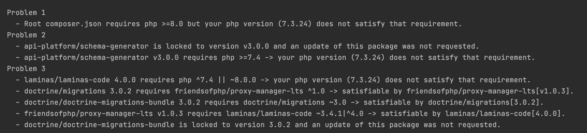
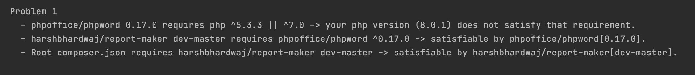

# my-backend

Contains the backend of Word Doc Converter application.

### To start the server:

`php -S localhost:8000 -t public`

### To get a word document:

send a GET request to `/reports` and set the parameter, `textBlock` to the text which is required in the Word Document.

## Why not API-Platform?

I was able to clone the API-Platform package and get it running and figured out that I only needed to add a custom controller in `/api/src/Controller` to handle requests coming to `/reports` endpoint similar to how it works in the current server.

 
- First error:

The API-platform requires PHP>=8.0, hence I installed PHP 8.0.1.
 
- Second error:

PHP 8.0.1 was able to resolve the above errors but when I tried installing the `harshbhardwaj/report-maker` package([link](https://packagist.org/packages/harshbhardwaj/report-maker)) using `composer require harshbhardwaj/report-maker`, I ran into the following error.

 
- Final conclusion:

The report-maker package depends on phpoffice/phpword version 0.17.0, which is the latest version. The phpword package in turn requires version 5.3.3 or 7.0 of PHP. The devs are working on a new version of phpword and there is [already an issue](https://github.com/PHPOffice/PHPWord/issues/1979) for the same.
